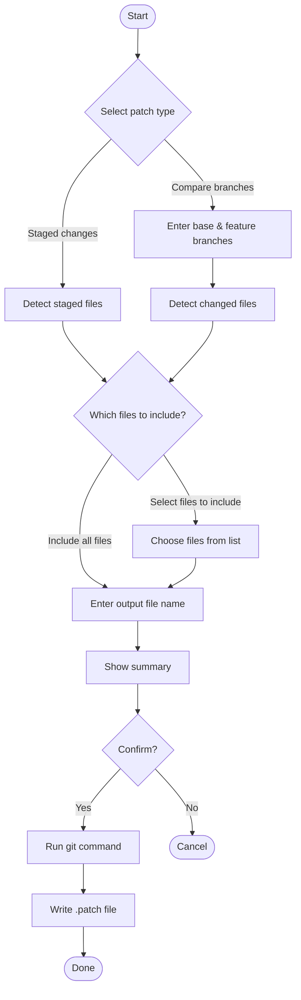

# patchgen

A guided CLI to generate Git patch files from staged changes and branch diffs.

`patchgen` helps developers generate `.patch` files with a cleaner and more guided workflow than manually typing Git patch commands.

## Quick start

```bash
npx patchgen
```

Or install globally:

```bash
npm install -g patchgen
patchgen
```

## Features

- Generate patches from staged changes
- Generate patches from branch diffs
- Include all files or select specific files to include
- Guided interactive CLI
- Predictable `.patch` output flow

## Why use patchgen?

You can always generate patches with raw Git commands. `patchgen` makes that workflow easier and more consistent by reducing command memorization and guiding you through patch creation step by step.

Patch files are also a practical way to share code changes with LLMs and AI assistants. Instead of pasting raw diffs or multiple files, a single `.patch` file gives the model a structured, complete picture of what changed — making it easier to get accurate reviews, suggestions, or explanations.

## Supported flows

### Staged changes

Generate a patch from files already staged in Git (`git diff --cached`).

### Compare branches

Generate a patch from the diff between a base branch and a feature branch (`git format-patch`).

### File selection

In both flows, after choosing the patch type, you can decide which files to include:

- **Include all files** — uses all changed files
- **Select files to include** — shows a multi-select list to pick specific files

> **Note:** When using "Select files to include" in Compare branches mode, the patch is generated with `git diff` instead of `git format-patch`, so **commit messages will not be included** in the output.

## Example

### Staged — include all files

```
◆ patchgen — Generate .patch files from your git repository
✔ Git repository detected.

◆ Select patch type:
● Staged changes — Generate a patch from staged files
○ Compare branches — ...

◆ Which files to include?
● Include all files
○ Select files to include

◆ Output file name: › staged.patch

┌ Summary
│ Patch type: Staged changes
│ Output file: staged.patch
└

✔ Generate patch? Yes

✔ Collecting staged changes...
✔ Done.
✔ Writing file...
✔ Patch saved to staged.patch

◆ All done!
```

### Compare branches — select files

```
◆ patchgen — Generate .patch files from your git repository
✔ Git repository detected.

◆ Select patch type:
○ Staged changes — ...
● Compare branches — Generate a patch from commits in a feature branch not present in a base branch

◆ Base branch: › main
◆ Feature branch: › feat/login

◆ Which files to include?
○ Include all files
● Select files to include

┌ Note
│ When selecting specific files in branch compare mode,
│ commit messages will not be included in the patch.
└

◆ Select files to include:
◼ src/auth/login.ts
◼ src/auth/utils.ts
◻ src/config.ts

◆ Output file name: › main-feat-login.patch

┌ Summary
│ Patch type: Compare branches
│ Base branch: main
│ Feature branch: feat/login
│ Files selected: 2 files
│ Note: Commit messages not included
│ Output file: main-feat-login.patch
└

✔ Generate patch? Yes

✔ Generating patch...
✔ Done.
✔ Writing file...
✔ Patch saved to main-feat-login.patch

◆ All done!
```

## Requirements

- Git
- Node.js 18+

## Current limitations

- Interactive-first workflow — scripted/piped mode is not yet supported
- Output directory is always the current working directory
- No diff preview before saving
- No support for generating multiple patch files in a single run

## Roadmap

- Non-interactive mode for use in CI pipelines
- `--output <dir>` flag
- Config file support (`.patchgenrc`)
- Colorized diff preview
- Shell completions for branch names

## Flow diagram



## Contributing

Issues and pull requests are welcome.

## License

MIT
