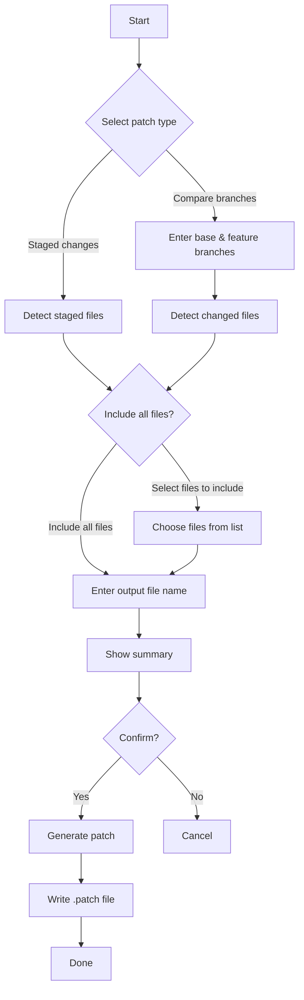

# patchgen

A CLI tool to generate `.patch` files from git repositories — faster and friendlier than running git commands manually.



## Overview

`patchgen` guides you through a simple interactive flow to generate `.patch` files from your git repository. It supports two modes:

- **Staged changes** — Captures everything currently staged with `git diff --cached`
- **Compare branches** — Captures all commits in a feature branch not present in a base branch using `git format-patch`

### File Selection

After choosing the patch type, you can decide which files to include:

- **Include all files** — Generates the patch with all changed files
- **Select files to include** — Shows a multi-select list to pick specific files

> **Note:** When using "Select files to include" in Compare branches mode, the patch is generated with `git diff` instead of `git format-patch`, so **commit messages will not be included** in the output.

## Requirements

- Node.js >= 18
- Git installed and available in `PATH`
- Must be run inside a git repository

## Installation

### Global install

```bash
npm install -g patchgen
```

### Use without installing

```bash
npx patchgen
```

## Usage

Run `patchgen` inside any git repository:

```bash
patchgen
```

The CLI will guide you through:

1. Detecting the git repository
2. Choosing the patch type
3. Collecting the necessary inputs (branches, if applicable)
4. Selecting which files to include (all or specific files)
5. Suggesting an output file name (editable)
6. Showing a summary before generating
7. Asking for confirmation
8. Writing the `.patch` file to the current directory

## Examples

### Staged changes

```
◆ patchgen — Generate .patch files from your git repository
✔ Git repository detected.

◆ Select patch type:
● Staged changes — Generate a patch from staged files
○ Compare branches — ...

◆ Which files to include?
● Include all files
○ Select files to include

◆ Output file name: › staged.patch

┌ Summary
│ Patch type: Staged changes
│ Output file: staged.patch
└

✔ Generate patch? Yes

✔ Collecting staged changes...
✔ Writing file...

◆ Patch saved to staged.patch
◆ All done!
```

### Compare branches

```
◆ patchgen — Generate .patch files from your git repository
✔ Git repository detected.

◆ Select patch type:
○ Staged changes — ...
● Compare branches — Generate a patch from commits in a feature branch not present in a base branch

◆ Base branch: › main
◆ Feature branch: › feat/login

◆ Which files to include?
● Include all files
○ Select files to include

◆ Output file name: › main-feat-login.patch

┌ Summary
│ Patch type: Compare branches
│ Base branch: main
│ Feature branch: feat/login
│ Output file: main-feat-login.patch
└

✔ Generate patch? Yes

✔ Generating patch...
✔ Writing file...

◆ Patch saved to main-feat-login.patch
◆ All done!
```

### Selecting specific files (Compare branches)

```
◆ patchgen — Generate .patch files from your git repository
✔ Git repository detected.

◆ Select patch type:
○ Staged changes — ...
● Compare branches — ...

◆ Base branch: › main
◆ Feature branch: › feat/login

◆ Which files to include?
○ Include all files
● Select files to include

┌ Note
│ When selecting specific files in branch compare mode,
│ commit messages will not be included in the patch.
└

◆ Select files to include:
◼ src/auth/login.ts
◼ src/auth/utils.ts
◻ src/config.ts
◻ tests/auth.test.ts

◆ Output file name: › main-feat-login.patch

┌ Summary
│ Patch type: Compare branches
│ Base branch: main
│ Feature branch: feat/login
│ Files selected: 2 files
│ Note: Commit messages not included
│ Output file: main-feat-login.patch
└

✔ Generate patch? Yes

✔ Generating patch...
✔ Writing file...

◆ Patch saved to main-feat-login.patch
◆ All done!
```

## Current Limitations

- Non-interactive (scripted/piped) mode is not yet supported
- No support for generating multiple patches in a single run
- Output directory is always the current working directory
- The `Compare branches` mode uses `git format-patch --stdout`, which requires both branches to be available locally
- No diff preview before saving

## Development

```bash
# Install dependencies
npm install

# Run in development mode
npm run dev

# Build
npm run build

# Run tests
npm test

# Run tests with coverage
npm run test:coverage

# Type check
npm run typecheck
```

## Project Structure

```
src/
├── core/               # Pure functions — no IO, no side effects
│   ├── patch-types.ts
│   ├── sanitize-file-segment.ts
│   ├── ensure-patch-extension.ts
│   ├── build-staged-file-name.ts
│   ├── build-branch-compare-file-name.ts
│   ├── build-staged-git-command.ts
│   ├── build-branch-compare-git-command.ts
│   ├── validate-branch-compare-input.ts
│   └── build-summary.ts
├── config/
│   └── patch-rules.ts  # Central extension point — register new patch types here
├── app/
│   └── generate-patch.ts  # Orchestration — wires core + infra
├── infra/
│   ├── git.ts          # Impure — runs git commands
│   ├── fs.ts           # Impure — file system operations
│   └── cli.ts          # Impure — prompt interactions via @clack/prompts
├── cli/
│   └── run.ts          # CLI entry point
└── index.ts            # Public API — exports core functions
tests/                  # Unit tests for pure functions
```

## Extensibility

Adding a new patch mode requires only adding a new entry to `src/config/patch-rules.ts`. The rest of the system picks it up automatically — no `switch` statements to update, no core changes needed.

Each `PatchRule` is a plain object with typed pure functions:

```ts
const myRule: PatchRule<MyParams> = {
  type: 'my-mode',
  label: 'My mode',
  description: 'Description shown in the selector',
  buildDefaultFileName: (params) => `my-output.patch`,
  buildGitCommand: (params) => ({ command: 'git', args: [...] }),
  validate: (params) => [],
  buildSummary: (params, outputFileName) => [
    { label: 'Patch type', value: 'My mode' },
    { label: 'Output file', value: outputFileName },
  ],
}
```

## v2 Ideas

- `--no-interactive` / scripted mode for use in CI pipelines
- `--output <dir>` flag to specify the output directory
- Support for outputting multiple patch files (one per commit)
- Apply a patch interactively with `git apply`
- Color-coded diff preview before confirming
- Config file support (`.patchgenrc`) for persistent defaults
- Shell completions for branch names

## License

MIT
