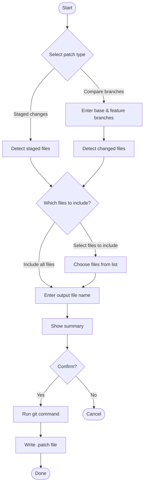

# CLI Flow

Complete reference for the patchgen interactive flow.

## Overview

```bash
npx patchgen
```

The CLI follows a linear, guided flow:



## Step-by-Step

### 1. Git Check

patchgen verifies you're inside a Git repository:

```
✔ Git repository detected.
```

If not, it exits with an error:

```
✖ This directory is not a Git repository. Please run patchgen inside a Git project.
```

### 2. Select Patch Type

```
◆ Select patch type:
● Staged changes — Generate a patch from staged files
○ Compare branches — Generate a patch from commits in a feature branch not present in a base branch
```

### 3. Branch Input (Compare Only)

For branch comparison, patchgen prompts for two branches:

```
◆ Base branch: › main
◆ Feature branch: › feat/login
```

Default suggestions:
- **Base branch** — detected default branch (`main` or `master`)
- **Feature branch** — currently checked-out branch

### 4. File Selection

```
◆ Which files to include?
● Include all files
○ Select files to include
```

If "Select files to include":

```
◆ Select files to include:
◼ src/auth/login.ts
◼ src/auth/utils.ts
◻ src/config.ts
```

### 5. Output File Name

```
◆ Output file name: › staged.patch
```

Default names:
- **Staged** → `staged.patch`
- **Branch compare** → `{base}-{feature}.patch` (e.g., `main-feat-login.patch`)

The `.patch` extension is added automatically if omitted.

### 6. Summary

```
┌ Summary
│ Patch type: Staged changes
│ Output file: staged.patch
└
```

Branch compare with file selection shows additional info:

```
┌ Summary
│ Patch type: Compare branches
│ Base branch: main
│ Feature branch: feat/login
│ Files selected: 2 files
│ Note: Commit messages not included
│ Output file: main-feat-login.patch
└
```

### 7. Confirmation

```
✔ Generate patch? Yes
```

Selecting "No" cancels the operation.

### 8. Overwrite Check

If the output file already exists:

```
✔ "staged.patch" already exists. Overwrite? Yes
```

### 9. Generation

```
✔ Collecting staged changes...
✔ Done.
✔ Writing file...
✔ Patch saved to staged.patch
```

### 10. Done

```
◆ All done!
```

## Error Handling

| Condition | Message |
| --- | --- |
| Not a git repository | "This directory is not a Git repository." |
| No staged changes | "No staged changes found." |
| No differences between branches | "No differences found between 'main' and 'feat/login'." |
| Git command failure | "Git error: {details}" |
| File write failure | "File error: {details}" |
| User cancels at any prompt | "Operation cancelled." |

## Cancellation

Press `Ctrl+C` or select "No" at the confirmation prompt to cancel at any point. No files will be written.
